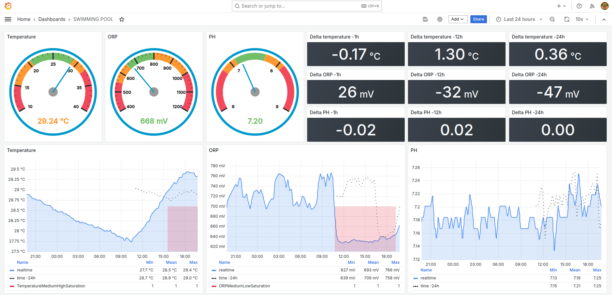
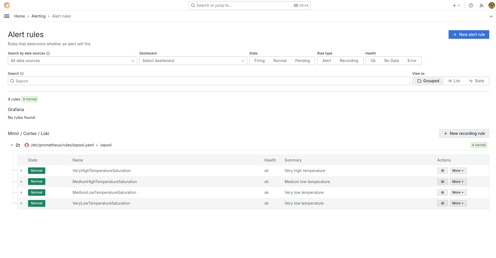
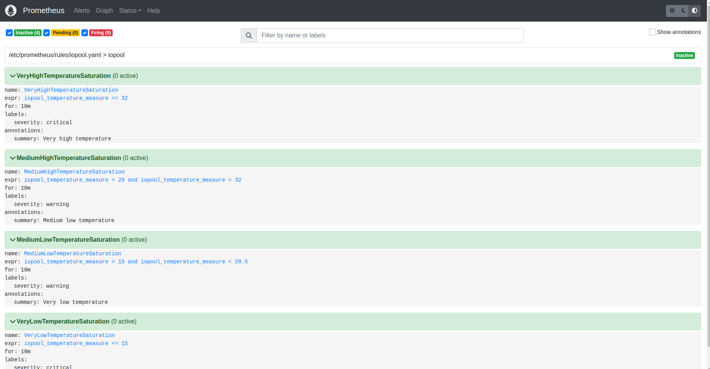

# IOPOOL PROMETHEUS EXPORTER

The main goal is to have prometheus exporter for your iopool metrics.  
With vector you can also have a lot of __sinks__ for your own usages, mqtt, etc.

* https://iopool.com
* https://vectors.dev

```sh
# Get all your pools, and then you can chose one "id"
$ curl -X GET -H "x-api-key: your_api_key" https://api.iopool.com/v1/pools
```

Create a .env file like that:

```txt
IOPOOL_API_KEY=xxxxxxxxxxxxxxxxxxxxx
IOPOOL_POOL_ID=yyyyyyyyyyyyyyyyyyyyyy
```

Docker usage:

```sh
# Start
$ docker network create iopool
$ docker compose up --detach
# Stop
$ docker compose down
$ docker network rm iopool
```

* Prometheus server: http://localhost:9090
* Grafana: http://localhost:3000

## Images

### Grafana dashboard


### Grafana alerts


### Prometheus rules

